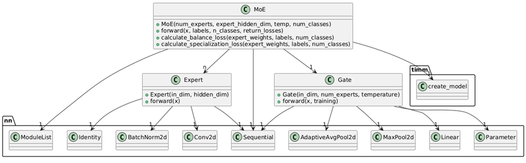
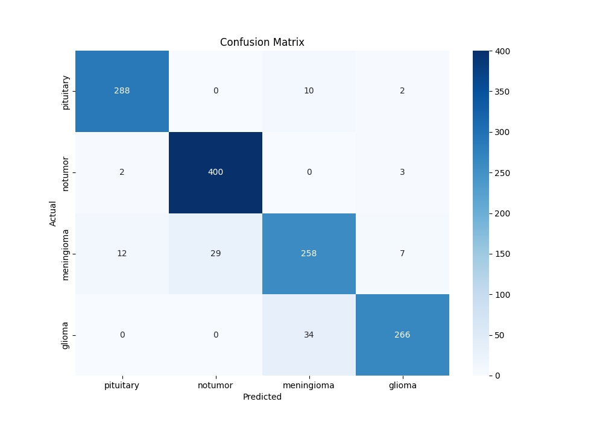
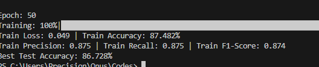
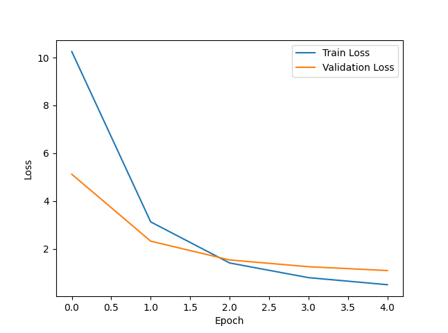

# brain-tumor-classifier - A Mixture of experts approach

Using pytorch's TIMM package to solve a classification problem

## Details of training
* Training and Testing, separate datasets  found at [kaggle](https://www.kaggle.com/datasets/masoudnickparvar/brain-tumor-mri-dataset)
* Using 2 Experts, with a backbone supported by efficientnet_b2
* Batch of 32 images
* Some image transformations
* Advanced training loops

## MoE Architecture

## Results

